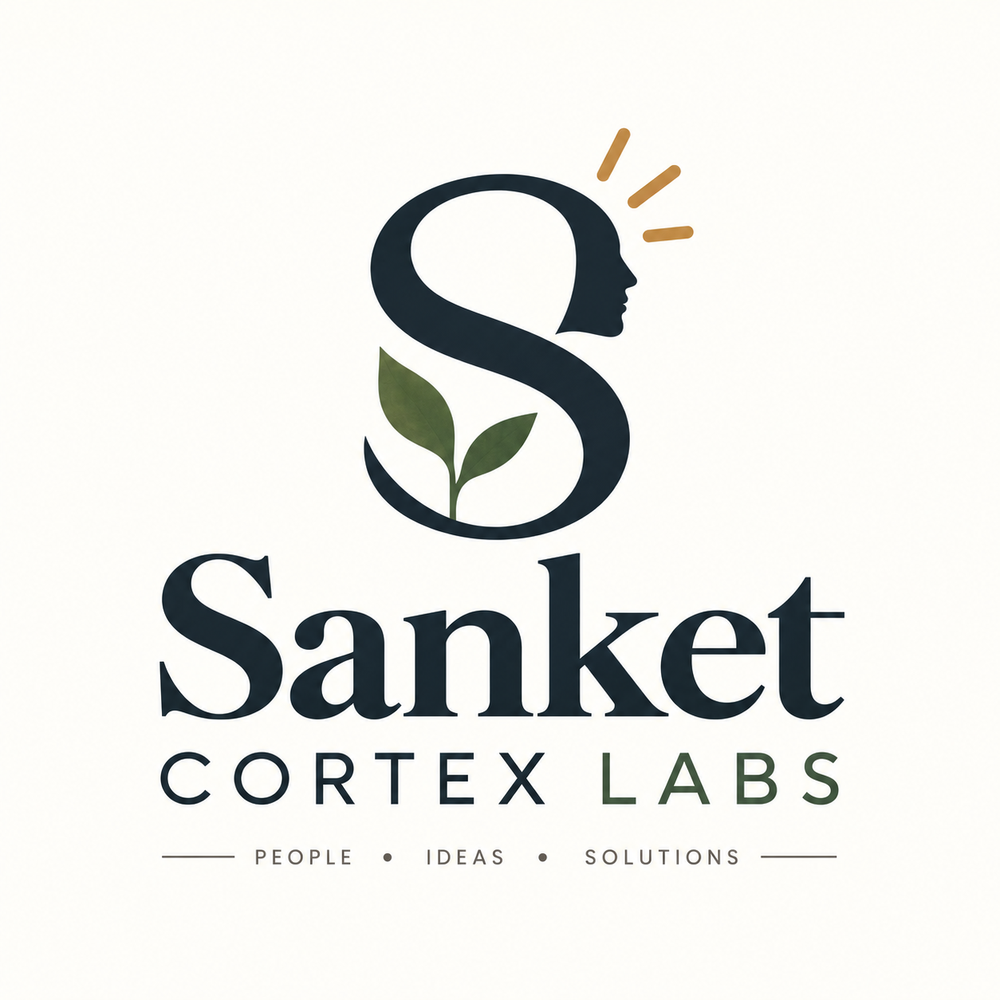

<div align="center">
  
  <h1>Susan AI</h1>
  <p><em>by Sanket Cortex Labs</em></p>
  <p>"Neural Solutions for a Smarter World"</p>
  <p><em>Alternative tagline: <strong>Decoding Intelligence</strong></em></p>
</div>

## About
Sanket Cortex Labs is an AI research and development studio focused on building intelligent, multimodal systems that bridge the gap between human creativity and machine intelligence.

Susan AI is our multi-model AI chat interface with BYOK (Bring Your Own Key) support.
Use DeepSeek, Claude, and Hugging Face models from a single unified interface.

## Features
- 🔑 BYOK - Your keys, your data
- 🔄 Multi-model support (DeepSeek, Claude, Hugging Face)
- ⚡ Real-time streaming responses
- 💾 Chat history with local persistence
- 📝 Markdown & code highlighting
- 📱 Fully responsive design
- 🎨 Dark theme with Sanket Cortex Labs branding

## Tech Stack
- Next.js 14 (App Router)
- TypeScript
- Tailwind CSS
- Vercel AI SDK
- React Markdown

## Getting Started

1. **Clone the repository:**
   ```bash
   git clone https://github.com/sanketcortexlabs/omnikey-ai.git
   cd omnikey-ai
   ```

2. **Install dependencies:**
   ```bash
   npm install
   ```

3. **Environment Setup:**
   Create a `.env.local` file in the root directory. You can use `.env.example` as a template, although API keys are primarily provided by users in the UI.

4. **Run the development server:**
   ```bash
   npm run dev
   ```
   Open [http://localhost:3000](http://localhost:3000) with your browser to see the result.

## Security
**Your keys are safe.**
Susan AI follows a strict BYOK (Bring Your Own Key) policy. API keys for DeepSeek, Anthropic, and Hugging Face are **never sent to or stored on our servers**.
All keys are obfuscated (Base64) and stored locally entirely within your browser's `localStorage`. (Note: In a true production environment, AES-256 encryption is recommended).

## License
MIT
